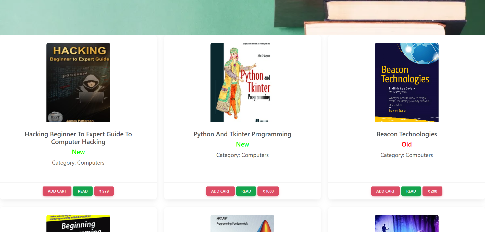
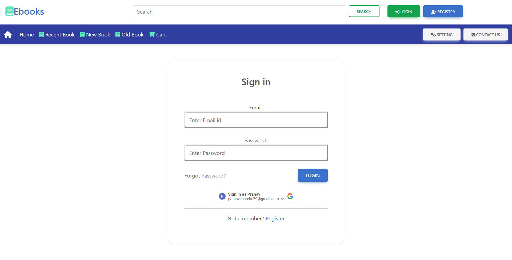
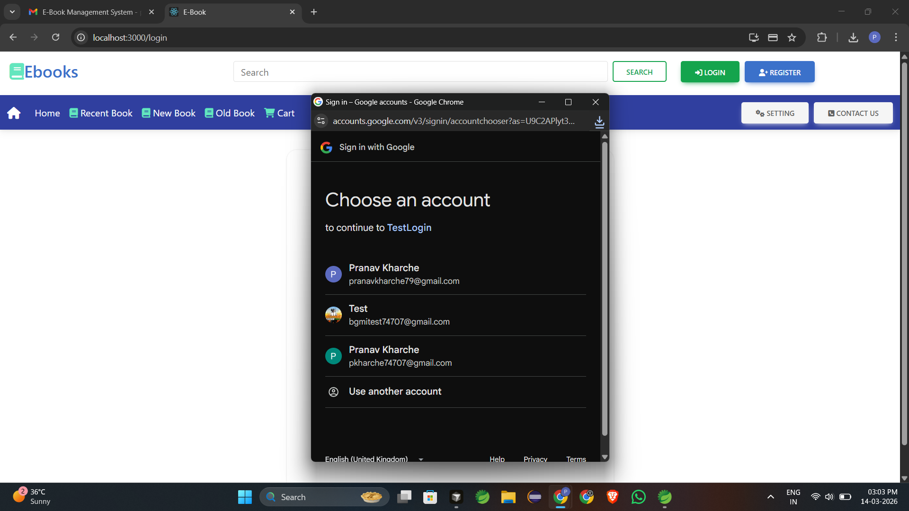
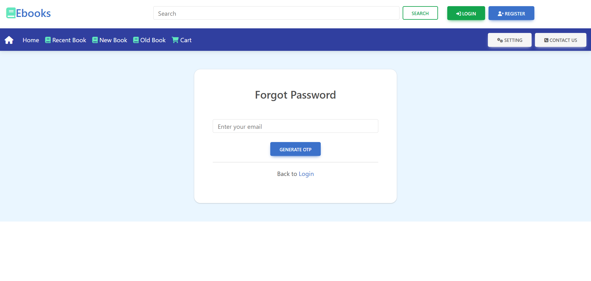
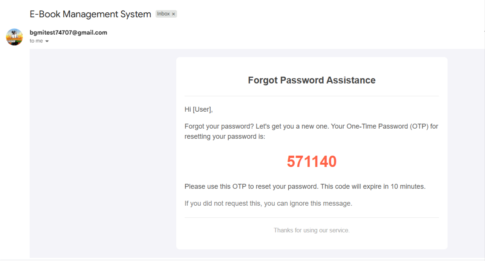
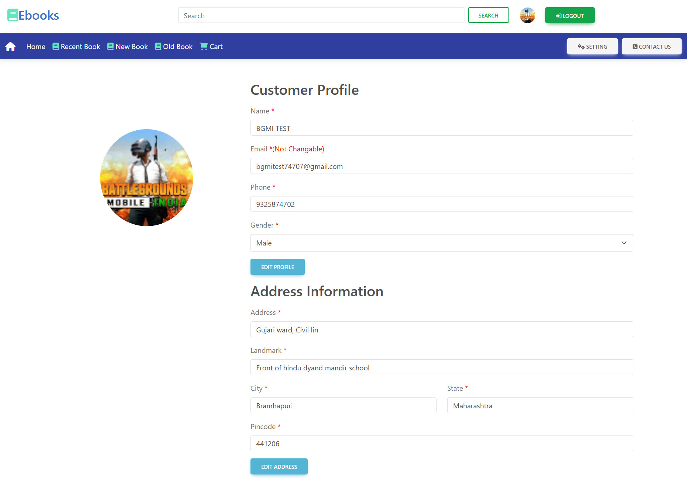
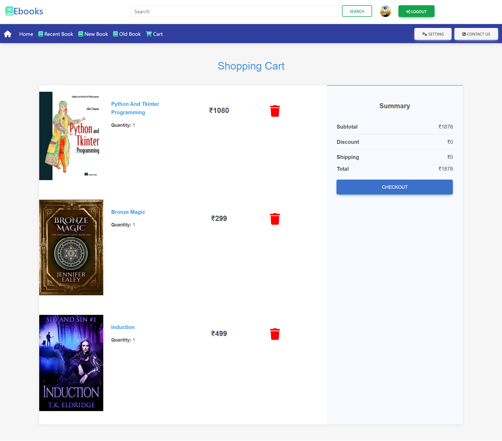
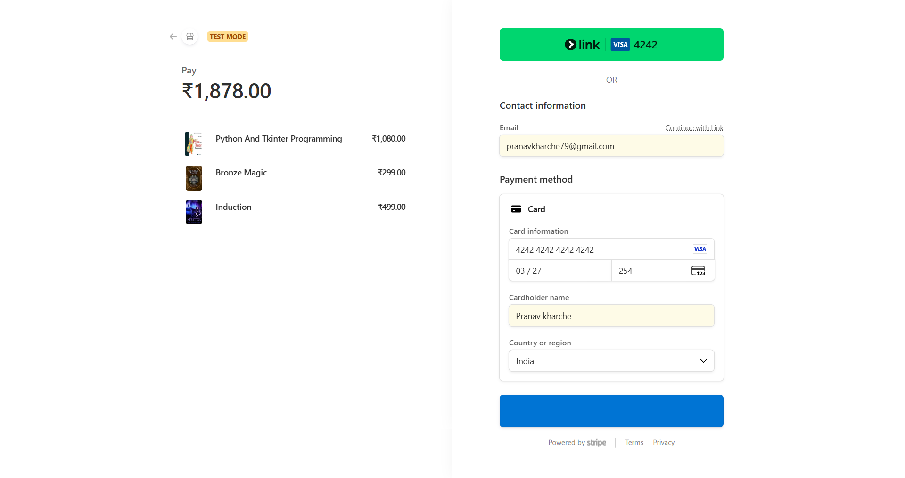
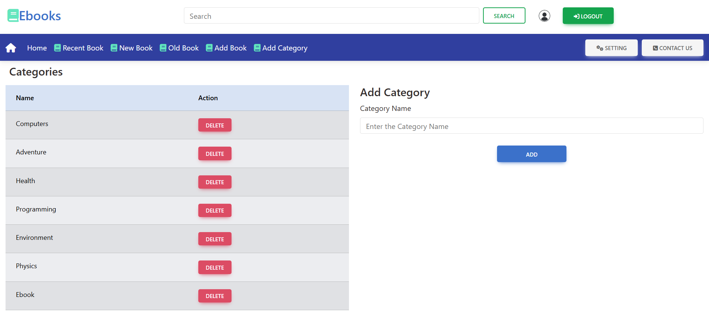
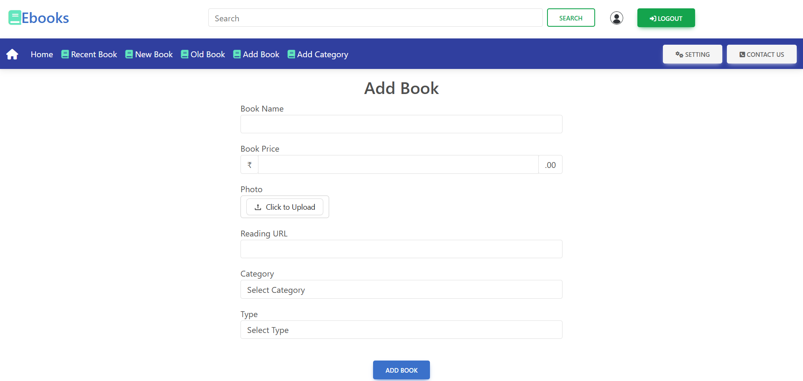

# E-Book Project

A full-stack E-Book management system and e-commerce platform built with React, Spring Boot, and MySQL.

## Features
- **User Authentication**: Standard Login, Registration, Google Login, and Forgot Password with Email OTP verification.
- **Product Catalog**: Browse books/products, view details, and manage categories.
- **Shopping Cart & Checkout**: Seamless cart management and checkout process.
- **Payment Integration**: Secure payments via Stripe.
- **User Profile**: Manage user profile and track orders.
- **Admin Panel**: Add and edit books, manage book categories.
- **Cloud Storage**: Image uploads handled via Cloudinary.

## Tech Stack
- **Frontend**: React.js, Redux Toolkit, Chakra UI, Ant Design, Bootstrap, Stripe-js.
- **Backend**: Java, Spring Boot, Spring Data JPA, JavaMailSender, Cloudinary.
- **Database**: MySQL.

## Demo Video

You can view the functional demo by checking the video below:
<video src="https://res.cloudinary.com/dvizikqng/video/upload/v1773492009/E-book_Demo_pdvahx.mp4" controls="controls" style="max-width: 100%;">
    Your browser does not support the video tag.
</video>

*(If the video doesn't play inline, [click here to watch it](https://res.cloudinary.com/dvizikqng/video/upload/v1773492009/E-book_Demo_pdvahx.mp4))*

## Screenshots

### Home Page


### Products Page


### Authentication
**Login Page**


**Register Page**


**Google Login Integration**


**Forgot Password**


**Email OTP Verification**


### User Profile


### Checkout & Payment
**Checkout Flow**


**Stripe Payment Gateway**


### Admin Panel
**Add Categories**


**Add Book**


## Setup Instructions

### Prerequisite
1. Import the existing database dump: `ebook.sql` into your local MySQL server.

### Backend Setup
1. Open the `Backend` project in your preferred Java IDE (Eclipse, IntelliJ IDEA, etc.).
2. Update the `application.properties` (or `.yml`) file with your MySQL database credentials, Cloudinary configuration, and email configuration.
3. Run the Spring Boot application.

### Frontend Setup
1. Open your terminal and navigate to the `frontend` folder: 
   ```bash
   cd frontend
   ```
2. Install dependencies:
   ```bash
   npm install
   ```
3. Start the development server:
   ```bash
   npm start
   ```
